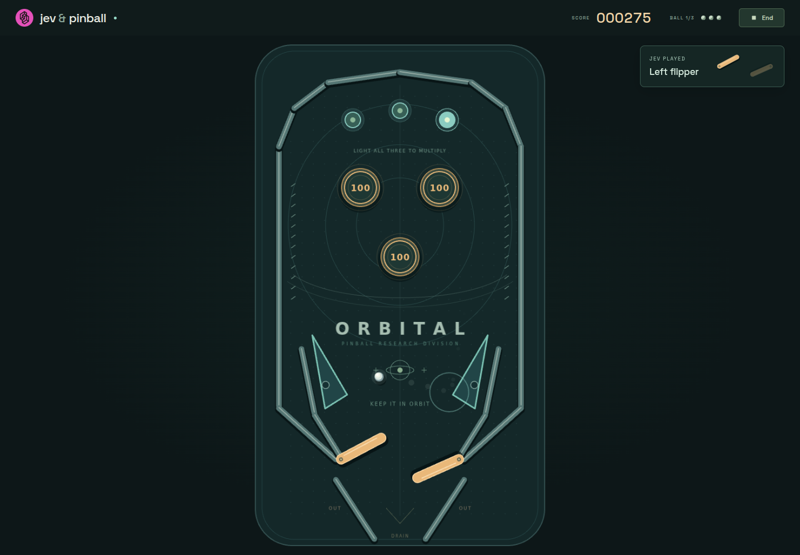

# jev & pinball

Watch Jev play pinball in real time. Physics never waits for a model response; the move notice shows which flippers Jev actually used.



## Run locally

Requires Node.js 22 or newer.

```sh
npm install
cp .env.example .env.local
# Add your TypeSafe API key to .env.local
npm run dev
```

## Deploy on Vercel

Import this repository into Vercel, select **Vite**, and add these environment variables:

| Variable | Value |
| --- | --- |
| `TYPESAFE_API_KEY` | Your TypeSafe API key — required, server-only |
| `TYPESAFE_DEFAULT_MODEL` | Optional; defaults to `jev-1.13.0` |

Deploy. The build and output settings are included in `vercel.json`. Never prefix the key with `VITE_` or commit `.env.local`.

Each browser gets its own three-ball game. Keep the tab open: refreshing or closing it ends the session. PixiJS renders the table, Rapier runs physics in a browser worker, and Vercel Functions call Jev.

## Check

```sh
npm run build
npm test
```

[TypeSafe AI](https://typesafe.ai/) provides Jev and the logo.
